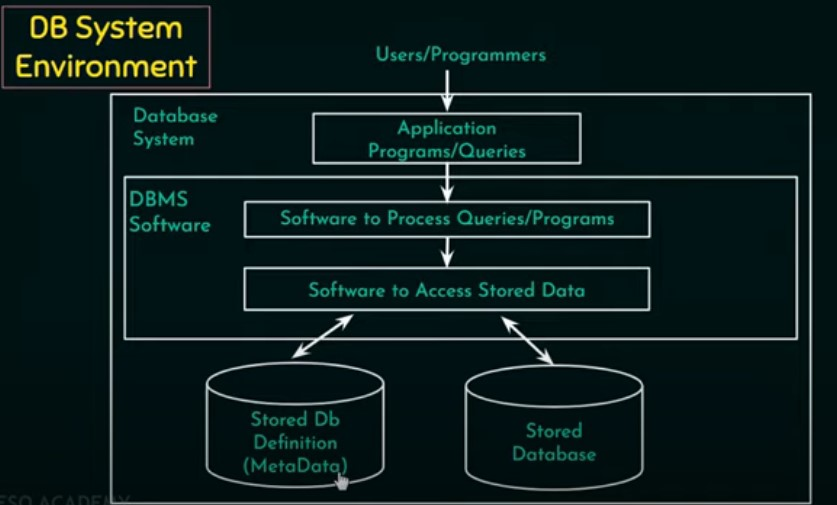

### Data : Any raw / Unprocessed fact.

- Ex: 20,Dehradun,Himanshu.

### Information : Processed data.

* Ex: Himanshu is 20 years old and lives in Dehradun.

### Database : Collection of related data.

### Meta-data : Description of the database. The database definition.

#  DBMS : 

Collection of programs that enables users to create and maintain the database.

## Functionalities

- ### Define DB : Specifying the data type, structure and constraints for the data to be stored.

- ### Construct DB : Process of storing data.

- ### Manipulate DB : Querying the database to retrieve specific data, updating database and generating reports.

- ### Share DB : Allows multiple users and programs to access the database concurrently. 

## Properties

- A database represents some aspects of the real word.
- A database is logically coherent collection of data with some inherent meaning.
- A database is designed  built and populated with data for a specific purpose.

DB System Environment

